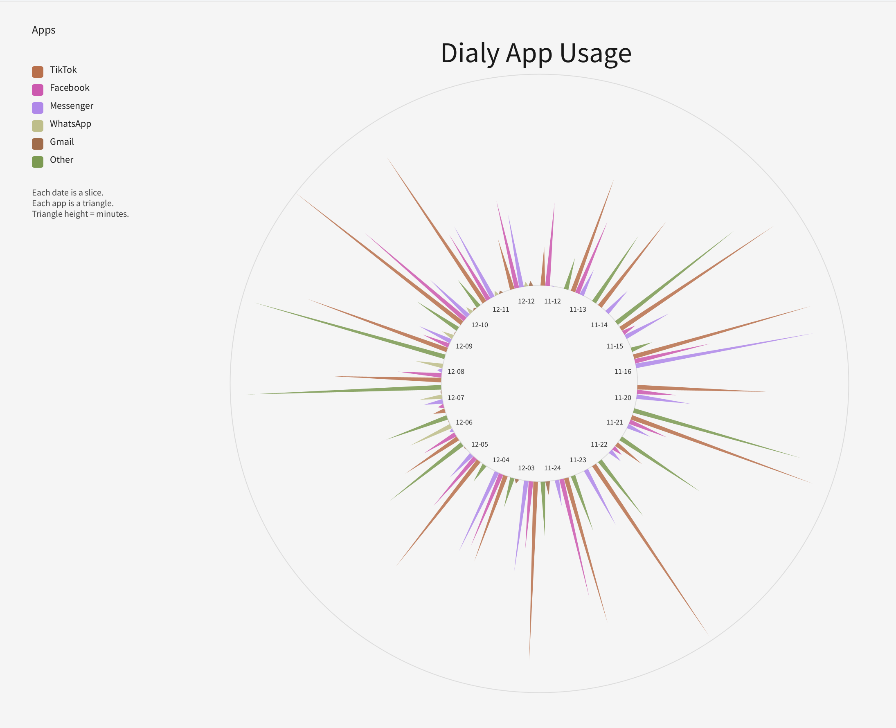

# App Usage Data Visualization

A radial data visualization built with **Processing (Java)** that transforms daily application usage data from CSV files into an interactive-style visual representation.

The project explores how raw numerical data can be mapped to graphical properties such as position, length, angle, and colour to make usage patterns easier to understand.

## Preview



## Features

- Loads and processes application usage data from CSV files
- Visualizes daily app usage in a radial layout
- Represents different applications using distinct colours
- Maps usage duration to graphical dimensions
- Uses polar coordinates to position data around a circular interface
- Displays date labels and a visual legend
- Converts structured numerical data into an interpretable visualization

## Technologies Used

- Processing
- Java
- CSV
- Data Visualization
- Git
- GitHub

## Project Structure

```text
app-usage-data-visualization/
├── data/
│   └── usage.csv
├── .gitignore
├── CC_project.pde
├── README.md
└── app-usage-preview.png
